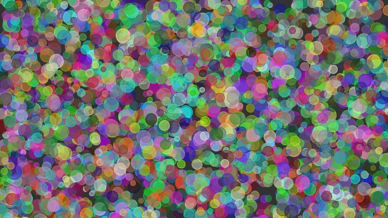
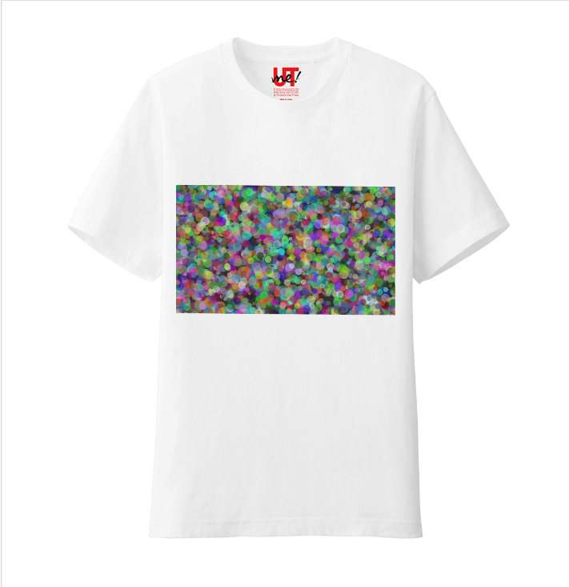
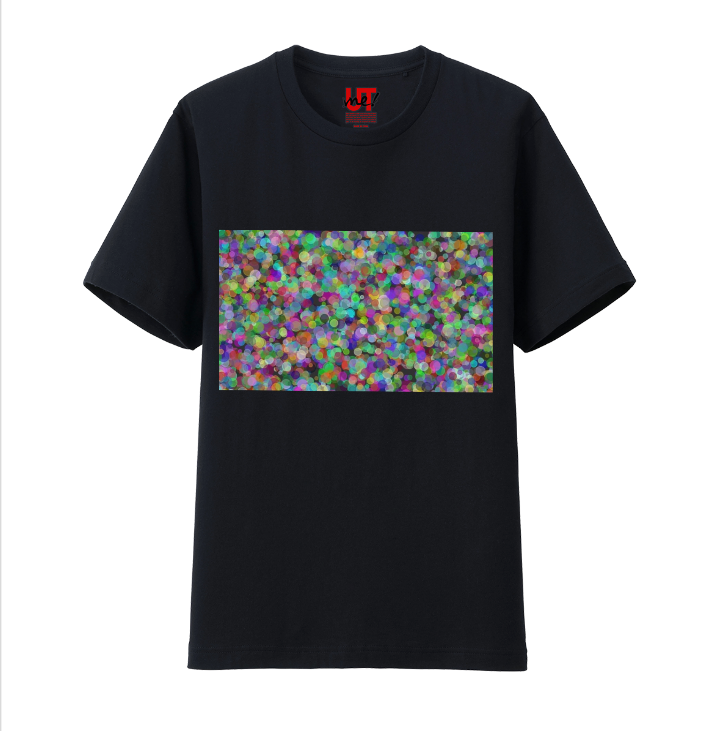
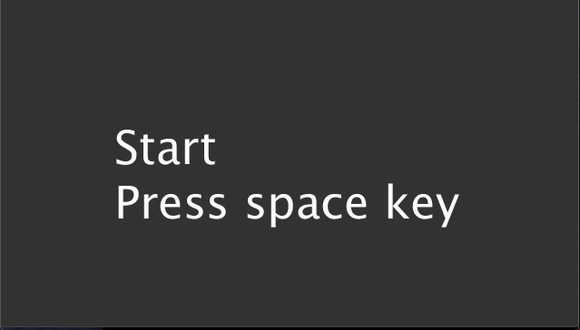
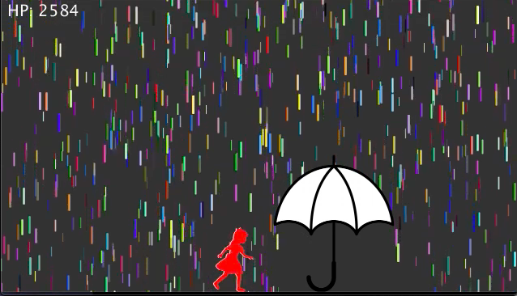
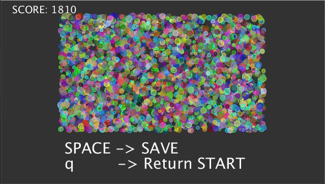

# Colorful-Rain

このアプリは, 雨をモチーフとしたミニゲームをプレイすることによって, 抽象画を作成することができます.
コンセプトは, 「カラフルな雨の中を歩き回ったとき,私達の服はどう汚れるのか?」です.

## Demo
### play image

### Output image
- 下記のような抽象画を取得することができます.

### Create original Tshirt

- 作成した抽象画をつかって, 実際にユニクロなどでTシャツを作れます.

https://utme.uniqlo.com/create/

- sample

## Feature
### コンセプト
プログラムを用いて, 簡単にランダムな抽象画を作成する方法は, 多くあります. しかしながら, すべてをプログラムにまかせると自分の作品として実感できないという問題点があります.

この問題点に対して, 本アプリがもつ誰でも作品を創作できるという特徴によって, 作品に親しみをもつことができます.
具体的には, 作者は, 雨の中を歩き回って服を汚すミニゲーム体験を通して, 抽象画を作成します.

参考にしたアクション・ペインティングと呼ばれる手法に関する引用を下記に記載します.

- アクション・ペインティングとは?
> アクション・ペインティングとは, 顔料を紙やキャンバスに注意深く塗るかわりに、垂らしたり飛び散らせたり汚しつけたりするような絵画の様式である。できた作品は、具体的な対象を描いたというより、絵を描くという行動（アクション）それ自体が強調されたものになる。
[https://ja.wikipedia.org/wiki/%E3%82%A2%E3%82%AF%E3%82%B7%E3%83%A7%E3%83%B3%E3%83%BB%E3%83%9A%E3%82%A4%E3%83%B3%E3%83%86%E3%82%A3%E3%83%B3%E3%82%B0]

### 技術面

技術的には, プレイヤーが操作するキャラクターにぶつかった雨粒の色情報をとサイズを記録することで抽象画を作成しています.

抽象画を生成するための情報を下記に示します.

|||
|:-:|:-|
|環境による乱数|- 雨粒のRGB情報 - 雨粒のサイズ - 雨粒の滴下位置 - 傘のランダムな配置|
|プレイヤーの操作| マウスの位置|

## Requirement

* Processing3

## Getting Started
### Download

OSに合わせて, 以下のディレクトリをダウンロードしてください.
|os|dir|
|:-:|:-:|
|Mac|exe/application.macosx|
|Win32bit| exe/application.windows32|
|Win64bit| exe/application.windows64|

また, ソースコードはsrc/ディレクトリにまとめてあるので, git cloneしてください.

### How to Play

|scene|image|operation|
|:-:|:-:|:-:|
|Start||press Space: Start Game  press "a": automode Start|
|Game||press "q": Return start|
|End| |press Space: Save to image   press "q": Return start|

### Quit App
- press "ESC" key

## Source code

- rain/

|file name|function|
|:-:|:-:|
|rain.pde|メインプログラム|
|drop.pde|Colorfulな雨粒のクラス|
|umbrella.pde|傘(セーフポイント)のクラス|
|player.pde|プレイヤークラス|
|field.pde|抽象画を描画するクラス|

 また, 以下のテスト用のModuleが含まれています.
 |file name|function|
|:-:|:-|
 |scene/|画面遷移用のテストモジュール|
 |outputimg/|画像を出力動作のテストモジュール|

## Authors

- ArataG: https://github.com/ArataG/

## Reference

- rain: 雨の描画には, 下記のサイトを参考にしました.
  - https://www.youtube.com/watch?v=KkyIDI6rQJI"

- scene: 画面遷移は, 下記のサイトを参考にしました.
  - https://gotutiyan.hatenablog.com/entry/2020/01/16/230106

- outputimg: 画像の出力は, 下記のサイトを参考にしました.
  - https://takawo.hatenablog.com/entry/2017/08/20/082907

  - https://dd15038.hatenablog.com/entry/2018/11/23/133229

- image source: ゲームのキャラクタは下記のサイトを利用しました.
  - https://kage-design.com/2016/01/01/alice1/

